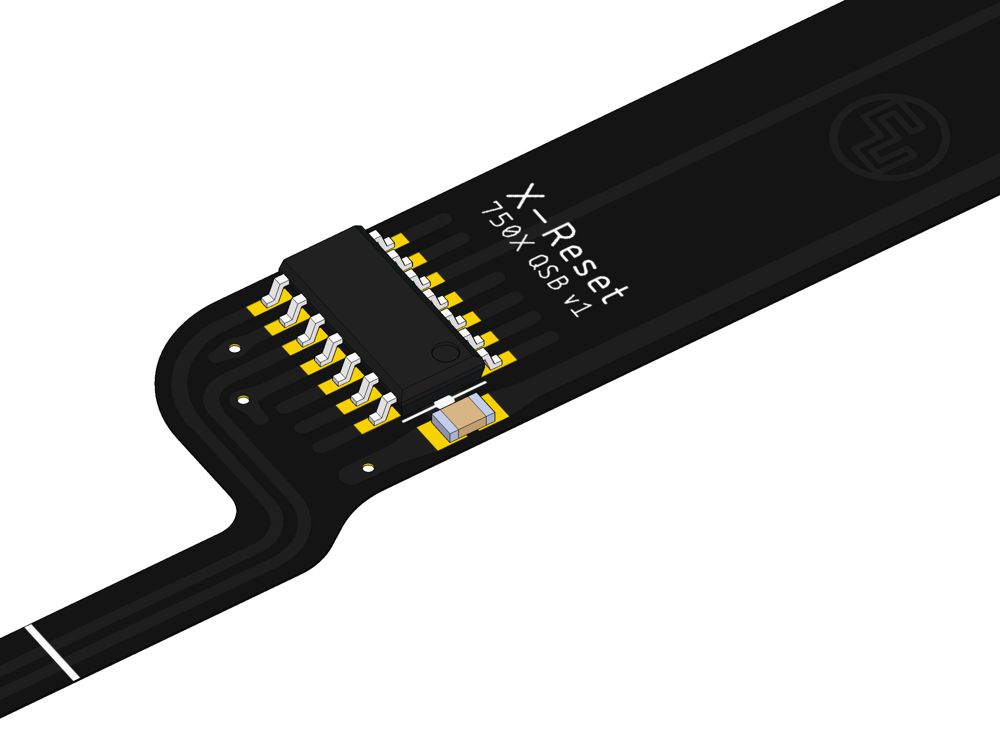

Working on designs to release for free can be both time consuming and expensive. If you like what I do, a small donation will go a long way in helping me continue to serve the modding community as best as I can, with many more free and original guides, designs, and ideas to come.

# Sony PlayStation X-Reset

X-Reset is a stylish in-game-reset mod for the Sony PlayStation which uses a controller button combination to reset the console. This is useful for resetting back to the game select menu for devices such as PSIO and X-Station. The name and design of X-Reset was done to closely resemble that of the X-Station Quick Solder Board.

Available here is X-Reset 750X which is the PlayStation PU-22 version of the X-Reset which installs with no wires.

## Manufacturing

X-Reset 750X - Flex PCB in the thickest possible available.

## Version History

### X-Reset 750X

- v1.0 - 02/08/2022
- v1.1 - 25/10/2023

## Where to Buy?

All versions of X-Reset can be purchased from https://www.consolesunleashed.com/product/sony-playstation-x-reset-mod-kit/

## License

If you use this in any way, shape or form, you must include a link back to this repository and mention me by name on any sales pages and social media posts. Not only will this help me to keep designing mod kits and offering them to the community, but it is basic common courtesy as well. Don't be a douchebag. :)

Also this 'GNU GENERAL PUBLIC LICENSE Version 2, June 1991'.

## Donate

Working on designs to release for free can be both time consuming and expensive. If you like what I do, a small donation will go a long way in helping me continue to serve the modding community as best as I can, with many more free and original guides, designs, and ideas to come.

